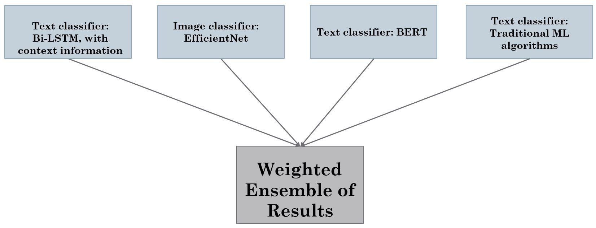
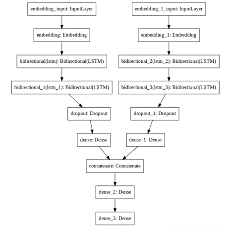

# Offensive content detection in Memes
***
This repository contains the different classifier models for offensive content detection in memes of MultiOFF dataset.
Brief overview:  

## Requirements
1. Transformers 3.0
2. Tensorflow 2.6.0
3. PIL
4. Nltk and other text processing and visualization libraries. 

## Generating and collecting Data
1. MultiOFF  
Developed by https://aclanthology.org/2020.trac-1.6/  
Link to dataset: https://drive.google.com/drive/folders/1hKLOtpVmF45IoBmJPwojgq6XraLtHmV6  
Contains offensive and non-offensive memes related to 2016 US presidential elections. 
Run script utils/update_multioff_folderstructure.py to update the contents of the dataset to suit for training the models. 
Run script utils/rename_multioff_files.py   
Separate a set of images to use as test set. The csv files data/multioff_off_nonoff.csv corresponds to that. The folder data/MultiOFF_Test is the test folder directory.  
The csvs in data/MultiOFF/multioff_non_offenive.csv and data/MultiOFF/multioff_offenive.csv contain the text information and the image paths for each of them for training. The similar csv for test is present in  data/multioff_test.csv.    

2. Fox News dataset  
Link to dataset: https://github.com/sjtuprog/fox-news-comments  
The file is currently stored in data/fox_news.csv  

3. Politics data  
Manually developed dataset on 12 classes.  
Steps to generate:  
a. Search for a phrase in google to have relevant set of images  
b. Install chrome plugin 'Image link Grabber' and copy and save all the links in a csv  
c. Run the script utils/download_google_images.py, it will download all the images stores in new directories for each class by filename.  
d. Rename image files in the class folders using utils/rename_politics_files.py. The dataset is currently present in data/dataset_csvs with all the csvs and updated files in classes.  
e. Run model classifiers/effnet_image_classifier_politics.py using run_model(prediction_file_path, output_file_path, boolean_new_data_check) method to train the model on the generated dataset and store results in outputs/effnet_meme_politics_offensive_train.csv and outputs/effnet_meme_politics_nonoffensive_train.csv, which are concatenated manually to generate effnet_meme_politics_all_train.csv file. SImilarly generate for test data, the file is outputs/effnet_meme_politics_test.csv    

4. Wikipedia context data of politicians  
Run script utils/download_wikipedia_content.py to download the relevant context data required for dataset generation of 5. The results are stored in data/wikipedia_context_files.txt.    

5. Context data: Create context data for context text classifier  
a. Merge politics output from part 3 with meme text, find a political person from text and merge with the meme text as new sentence.  
b  Use this sentence for cosine similarity with the wikipedia context data and get context for each meme text and save context information of top k sentences. It is done using classifiers/create_context_data.py.The saved results are stored in data/multioff_context_train_data.csv and data/multioff_context_test_data.csv for training and testing respectively.  

## Classifiers:  
1. Text Classifier: Bi-LSTM with context information  
The architecture for this network is as follows:  

It requires Context data for training and testing.  
To run the model, in the file classifiers/context_text_classifier.py, execute run_model(train_path, predict_path). It will store the results in output folder and return the dataset of prediction.    

2. Image classifier: EfficientNetv2-m model   
It required MultiOFF image data for training and testing.
To run the model, in the file classifiers/effnet_image_classifier_multioff.py, execute run_model(predict_path). It will store the results in output folder and return the dataset of prediction.    

3. Text classifier: BERT  
Offensive speech classification pre-trained on fox news dataset. It loads fox news and fine tuned MultiOFF text pretrained weights of BERT.  
To run the model, in the file classifiers/bert_fox_meme.py, execute run_model(predict_path). It will store the results in output folder and return the dataset of prediction.    

4. Text classifier: ML models  
Uses the MultiOFF text and Fox news dataset for training 4 different ML algorithms, namely naive bayes, SVC, k nearest neighbour and decision trees.  
To run the model, in the file classifiers/ml_algo_multioff_text.py, execute the method run_model(train_path, test_path, model_name). The training file used is data/multioff_fox_combined.csv which is concatenated manually. The results are stored in output folder.     

5. Ensemble of the models: Bi_LSTM, EfficientNet, BERT, ML models  
The final results can be ensembled using the outputs of each model.  
Run the script ensemble_classifier.py and it will generate all the ensemble results. They are stored in outputs/ensembled_result.csv.      

The classification reports can be viewed and stored using the script in utils/get_classification_report_from_outputs.py. For printing classification report, use method print_classification_report(model_output_path, prediction_column, actual_value_col). To print and save, run method save_classification_report(model_output_path, file_save_path, prediction_col,actual_value_column). The results will be stored in classification_reports/.

### Outputs and Results
The current outputs are stored in outputs/ directory and results of classification can be seen in classification_reports/ directory.

### Weights
The models will store the weights in weights/ directory and wil continue to utilize them if they are already present in the directory.  
The weights can be found at https://drive.google.com/drive/folders/1gPkhpasDZT2CLiZ5TWQ9Su4Roe5XNt1r?usp=sharing .

